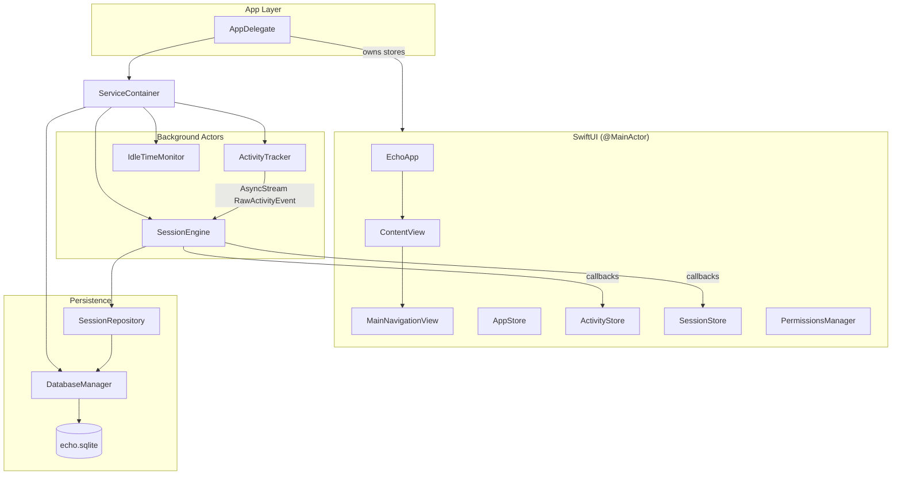

# Echo macOS codebase analysis
_Exported on 5/16/2026 at 13:45:38 GMT+5:30 from Cursor (3.4.20)_

---

**User**

Analyze the entire Echo macOS codebase deeply before modifying anything.

Understand:

* architecture
* actor isolation
* database layer
* stores
* dependency graph
* ActivityTracker
* SessionEngine
* Swift concurrency usage
* UI hierarchy
* service container structure

Then provide:

1. Current architecture overview
2. System strengths
3. Architectural weaknesses
4. Scalability concerns
5. Potential threading/performance risks
6. Best next implementation priorities

Do not generate code yet.


---

**Cursor**

Exploring the Echo macOS codebase systematically before any analysis or changes.


Reading core files to validate details and deepen the analysis.


# Echo macOS — Architecture Analysis

Echo is a **small, early-stage menu-bar app** (~21 Swift files, single `Echo` target) with a **working capture → sessionize → persist → live UI** pipeline. Much of the schema and UI is scaffolded ahead of product features.

---

## 1. Current Architecture Overview

### High-level shape

Layered pipeline with a manual composition root:



### Boot sequence

1. **`AppDelegate`** creates stores eagerly so SwiftUI can bind immediately.
2. **`ServiceContainer`** (on `@MainActor`) opens DB, wires `SessionRepository` → `SessionStore`, builds actors.
3. **`start()`** order: `ActivityTracker.start()` → `SessionEngine.configure(tracker:)` → `IdleTimeMonitor.start()` → `SessionEngine.start()` → `SessionStore.loadRecent()` → `AppStore.setReady()`.
4. Teardown blocks exit with a semaphore while flushing the final session.

### Module responsibilities

| Layer | Types | Role |
|-------|--------|------|
| **App** | `EchoApp`, `AppDelegate`, `EchoCommands` | Entry, lifecycle, menu commands |
| **Services** | `ServiceContainer` | Composition root, startup/teardown |
| **Capture** | `ActivityTracker`, `IdleTimeMonitor` | OS signals → `RawActivityEvent` stream; IOHID idle |
| **Domain** | `SessionEngine` | Session boundaries, batching, metrics, store callbacks |
| **Persistence** | `DatabaseManager`, `SessionRepository` | GRDB pool, migrations, queries |
| **Stores** | `AppStore`, `ActivityStore`, `SessionStore` | `@Published` UI state |
| **UI** | `ContentView`, `MainNavigationView`, stubs | Routing, sidebar, placeholders |

### Actor isolation map

| Isolation | Types |
|-----------|--------|
| **`actor`** | `ActivityTracker`, `SessionEngine`, `IdleTimeMonitor` |
| **`@MainActor`** | `ServiceContainer`, all stores, `PermissionsManager`, tracker’s `setupWorkspaceObservers()` |
| **`Sendable`** | `RawActivityEvent`, `SessionEndReason`, `DatabaseManager`, `SessionRepository` |
| **`nonisolated`** | `EchoConfig`, `IdleTimeMonitor.readIdleTime()` |

Build flags: `SWIFT_DEFAULT_ACTOR_ISOLATION = MainActor` and `SWIFT_APPROACHABLE_CONCURRENCY = YES` — unannotated types default to MainActor unless opted out.

### Data flow (runtime)

1. **ActivityTracker** emits `.appFocus` on app change and `.appSwitch` when focus closes (duration > 0.5s) via `NSWorkspace` notifications + 3s frontmost-app polling.
2. **SessionEngine** consumes the `AsyncStream`, may split sessions on inter-event gap (>300s) or idle callback, stamps `ActivityEvent`, appends to `ActivityStore`, batches to DB every 10s.
3. **SessionStore** mirrors session list for UI; **ActivityStore** holds live session + last 100 events + duration timer.

### UI hierarchy

```
EchoApp
├── WindowGroup → ContentView
│   ├── LaunchView (launching)
│   ├── OnboardingView
│   ├── PermissionsView
│   ├── ErrorView
│   └── MainNavigationView (ready)
│       ├── SidebarView (+ LiveSessionPill → ActivityStore)
│       └── HomeView | TimelineView | SearchView (placeholders)
└── MenuBarExtra → MenuBarView (ActivityStore, AppStore)
```

`SessionStore` is injected via `.environmentObject` but **no view reads it yet**.

### Database schema (v1)

Tables: `sessions`, `activities` (used), `app_usage`, `snapshots` (schema + repo methods only). Single migration `v1_initial`. DB at `~/Library/Application Support/Echo/echo.sqlite`.

### Dependency graph (who owns what)

```
AppDelegate
  ├── AppStore, SessionStore, ActivityStore, PermissionsManager  (public to SwiftUI)
  └── ServiceContainer (private)
        ├── DatabaseManager
        ├── SessionRepository → configured into SessionStore
        ├── ActivityTracker
        ├── IdleTimeMonitor
        └── SessionEngine(repo, activityStore, sessionStore, idleMonitor)
```

SwiftUI never sees `ServiceContainer`; stores are the public boundary.

---

## 2. System Strengths

1. **Clear layering** — Capture, session logic, persistence, and UI are separated. Stores do not touch GRDB directly; `SessionRepository` owns queries.

2. **Sensible concurrency model** — Hot path runs on actors; `RawActivityEvent` is `Sendable` across the stream boundary; UI mutations stay on `@MainActor`.

3. **Ordered startup contract** — `configure(tracker:)` before `start()` is documented and enforced in `ServiceContainer`.

4. **Resilient batch writes** — Failed `insertBatch` re-queues events instead of silently dropping them.

5. **Dual idle detection** — IOHID monitor + inter-event gap at the same threshold (`EchoConfig.sessionIdleTimeout`) provides redundancy.

6. **Early UI availability** — Stores exist before DB init; failure surfaces via `AppStore.setFailed` without crashing.

7. **`EchoConfig` as `nonisolated`** — Shared constants readable from any actor without hops.

8. **Infrastructure vs. repository split** — `DatabaseManager` is migrations + pool only; domain queries live in `SessionRepository`.

9. **Modern SwiftUI shell** — `NavigationSplitView`, menu bar extra, permission gating, and live session pill are cohesive foundations.

---

## 3. Architectural Weaknesses

1. **Incomplete product surface vs. rich schema** — `AppUsage`, snapshots, browser tabs, window layout, and extra `ActivityType` cases exist in models/DB but are not wired into the pipeline. This creates **schema drift risk** and dead code (`BrowserTabScraper`, `WindowLayoutCapture`).

2. **`SessionStore` is a dead UI dependency** — Loaded and updated by the engine, but Home/Timeline/Search are placeholders. The data layer is ahead of the presentation layer.

3. **No protocol-based boundaries** — Concrete types everywhere; hard to unit-test `SessionEngine` or swap persistence without refactoring.

4. **Notification-based commands without subscribers** — `EchoCommands` posts `.echoOpenSearch` / `.echoSaveSnapshot`; nothing observes them. Declared `.echoSessionCreated` / `.echoActivityRecorded` are never posted.

5. **Permissions model is half-built** — `automationGranted` is never updated; `allGranted` is accessibility-only despite browser scraping needing Automation.

6. **`ServiceContainer` holds unused `permissionsManager`** — Pass-through only; permissions are not part of service lifecycle.

7. **`SessionEndReason` / `minSessionDuration` unused** — No minimum session length, no user-initiated end, no explicit boundary heuristic path.

8. **GRDB pinned to `master`** — Build reproducibility and upgrade risk.

9. **No test target** — Concurrency and session-boundary logic are untested.

10. **Known data bug** — `closeCurrentAppFocus` sets `appName: bundleId` on `.appSwitch` events:

```155:164:Echo/Core/ActivityTracker/ActivityTracker.swift
        emit(RawActivityEvent(
            id: UUID(),
            timestamp: appFocusStart,
            type: .appSwitch,
            appBundleId: bundleId,
            appName: bundleId,
            ...
```

11. **Session gap after idle** — When idle ends a session, `currentSession` is nil. The next event only creates a session if `elapsed > sessionIdleTimeout`; otherwise `guard let session` drops the event. Usually aligned in practice, but it is a latent correctness hole.

12. **Idle ends session but does not resume on wake** — Returning from idle does not call `beginNewSession()`; reliance on the next app event + gap heuristic is implicit and fragile.

---

## 4. Scalability Concerns

| Area | Concern |
|------|---------|
| **Event volume** | Per-switch events + 3s polling; no deduplication between notification and poll paths. Heavy switchers → large `activities` table, frequent MainActor hops (`activityStore.append` per event). |
| **DB writes** | Batch insert loops row-by-row in one transaction; fine now, but no indexing strategy beyond defaults, no archival/compaction, no FTS for search. |
| **Memory** | `ActivityStore` caps at 100 events; `SessionEngine.pendingEvents` can grow between 10s flushes during bursts. |
| **Session list** | `fetchRecent(limit: 30)` only; no pagination, date filtering, or background prefetch for timeline UI. |
| **Snapshots / blobs** | `SessionSnapshot` stores layout + tabs as blobs — unbounded growth if enabled without retention policy. |
| **AppleScript scraping** | `BrowserTabScraper` is synchronous and blocking; not integrated, but if wired naively it will not scale across browsers/sessions. |
| **Single repository** | All persistence in `SessionRepository`; as features grow (search, analytics, exports), this will become a god-object without split repos or use-cases. |
| **Single process** | No extension/plugin model; all capture in one app process. |

---

## 5. Potential Threading / Performance Risks

1. **MainActor churn on hot path** — Every event: `await MainActor.run { raw.stamped(...) }` + `await activityStore.append(...)`. High switch rate → serial MainActor queue pressure and UI jank risk.

2. **Duplicate detection paths** — `NSWorkspace` activation + 3s polling can race near-simultaneous transitions; actor serialization prevents corruption but may emit redundant work.

3. **`Task` spawned from observer blocks** — Each activation creates `Task { await self?.handleAppActivation(...) }`; under flapping apps this spawns many unstructured tasks (actor serializes handlers, but scheduling overhead remains).

4. **`Task.detached` polling** — Correct for not blocking the actor, but repeated `MainActor.run` every 3s even when idle.

5. **Idle callback → unstructured `Task`** — `IdleTimeMonitor` fires `Task { await self?.endCurrentSession(...) }` from MainActor callback; fine today, but competes with stream processing with no explicit ordering.

6. **Double session end** — Idle monitor and gap heuristic can both call `endCurrentSession` close together (benign no-op on second call, but extra DB work possible).

7. **`applicationWillTerminate` + `DispatchSemaphore`** — Blocks the main thread during teardown. Acceptable for short flush; risky if DB or actor work stalls.

8. **`ActivityStore` duration timer** — 1 Hz `Task` updating `@Published sessionDuration`; low cost but always on while session active.

9. **`PermissionsManager` 2s poll** — AX check on MainActor forever; minor but unnecessary once granted (no backoff).

10. **GRDB `Sendable` wrappers** — Relies on GRDB’s pool isolation; domain structs (`Session`, `ActivityEvent`) are not `Sendable` — safe today via actor/MainActor stamping, but easy to violate as code grows.

11. **No backpressure on `AsyncStream`** — Unbounded buffering if `SessionEngine` falls behind capture (unlikely at current rates, but no explicit policy).

---

## 6. Best Next Implementation Priorities

Ordered by impact vs. effort, assuming the goal is a credible v1 product on the existing foundation:

### P0 — Correctness & trust

1. **Fix `.appSwitch` `appName` bug** in `ActivityTracker.closeCurrentAppFocus`.
2. **Fix post-idle session resumption** — After `endCurrentSession(.idle)`, ensure the next activity always gets a session (`beginNewSession` when `currentSession == nil`, not only on gap).
3. **Enforce `minSessionDuration`** or filter noise sessions before persisting.
4. **Deduplicate capture** — Choose notification-primary with poll as fallback, or debounce transitions.

### P1 — Ship visible product value

5. **Wire `SessionStore` into Timeline (and Home)** — Replace placeholders; session list + detail is the core UX promise.
6. **Load session activities on selection** — `SessionRepository.fetchActivities` exists but is unused in UI.
7. **Honor menu commands** — Wire `.echoOpenSearch` to `AppStore` tab/modal; implement snapshot save or remove the command.
8. **Live session pill accuracy** — Hide or change state when `currentSession == nil` (post-idle).

### P2 — Permissions & richer capture

9. **Complete permissions** — Track Automation for browser scraping; gate features explicitly.
10. **Integrate capture helpers deliberately** — Either wire `BrowserTabScraper` / `WindowLayoutCapture` into `ActivityTracker` with throttling and background execution, or delete/defer to avoid schema lies.
11. **Populate `app_usage` incrementally** — Avoid recomputing from raw events at read time.

### P3 — Engineering health

12. **Pin GRDB to a release version** (not `master`).
13. **Add a test target** — Session boundary rules, batch re-queue, idle + gap interaction.
14. **Introduce protocols** for `SessionRepository` / tracker if testing matters.
15. **Reduce MainActor hops** — Stamp on `SessionEngine` actor if `ActivityEvent` creation is made safe; batch UI updates.

### P4 — Scale path (when usage grows)

16. **Pagination + indexes** for timeline/search.
17. **FTS or search index** table if Search tab is real.
18. **Snapshot retention policy** before enabling blob storage.
19. **Consider structured logging** instead of `print` for engine errors.

---

## Summary

Echo has a **solid skeleton**: actor-isolated capture, stream-based handoff, GRDB persistence, and MainActor stores for SwiftUI. The architecture is appropriate for an early macOS activity/session tracker.

The main gaps are **product completion** (UI not consuming `SessionStore`), **scaffolded-but-unwired features** (browser, snapshots, app usage), and a few **correctness edges** (app name on switch, post-idle session creation, duplicate capture paths). Addressing P0 correctness and P1 Timeline UI will yield the highest leverage before expanding capture breadth or search/snapshots.

No code was modified per your request. When you want to proceed, say which priority tier to implement first.

---

**User**

Phase 2 begins now.

The infrastructure foundation is complete.

Now focus on transforming Echo from an engineering framework into a real product experience.

PRIORITY:
The app must start feeling alive and context-aware.

Implement the following using REAL tracked data from the existing ActivityTracker and SessionEngine.

1. Live Session Dashboard
   Create a premium Home dashboard showing:

* active session
* current app
* session duration
* workflow title
* recent activity
* focus indicators

2. Dynamic Session Naming
   Generate intelligent human-readable session titles from:

* dominant app
* repo names
* browser tabs
* terminal context
* time of day

3. Activity Feed
   Display real-time tracked events in a clean timeline/feed UI.

4. Mini Timeline Visualization
   Visualize:

* app switches
* focus intensity
* session continuity

5. Persistence Validation
   Ensure sessions restore correctly after relaunch.

6. UI Quality
   The app should feel:

* calm
* premium
* cinematic
* Apple-native
* alive

Avoid generic SwiftUI tutorial styling.

Use:

* translucency
* subtle depth
* spring animations
* elegant spacing
* hover effects
* tasteful gradients

IMPORTANT:
Do not add AI features yet.
Do not add cloud sync.
Do not add excessive settings.

Focus entirely on:
making Echo emotionally compelling through live contextual awareness.


---

**Cursor**

Implementing Phase 2: exploring the codebase and building the live dashboard, session naming, activity feed, mini timeline, and session restoration.


Implementing Phase 2: core engine fixes (session restore, naming), enhanced stores, and premium UI components.


# Phase 2 complete — Echo feels alive

Phase 2 turns the existing pipeline into a **context-aware product surface** using real `ActivityTracker` / `SessionEngine` data. No AI, cloud, or settings bloat.

---

## What shipped

### 1. Live Session Dashboard (`HomeView`)
Premium home screen with:
- **Workflow title** (dynamic session naming)
- **Live session badge** + duration
- **Focus ring** (live score + label: Deep focus / Steady flow / etc.)
- **Current app** card with real app icon
- **Focus rhythm** mini timeline
- **Live activity feed**

Visual language: ambient gradients, ultra-thin materials, spring motion, hover scale, depth shadows.

### 2. Dynamic Session Naming (`SessionTitleGenerator`)
Titles from **real events**:
- Dominant app + workflow verbs (“Building in Xcode”)
- Multi-app blends (“Xcode & Safari”)
- Repo/window heuristics (Xcode `.xcodeproj`, VS Code/Cursor ` — ` titles)
- Browser context (window title / URL host when present)
- Terminal window titles
- Time-of-day fallback (“Morning Session”)

Titles refresh every few events and save to SQLite.

### 3. Activity Feed (`ActivityFeedView`)
Real-time feed from `ActivityStore.recentEvents` — app icons, focus/switch labels, window titles, timestamps, hover states.

### 4. Mini Timeline (`MiniTimelineView` + `SessionTimelineBuilder`)
- Colored blocks weighted by focus duration
- Switch markers on app changes
- **Continuity bar** for focus intensity
- “% steady” derived from recent switch rate

### 5. Persistence & session restore (`SessionEngine`)
On launch:
- Resumes **active** DB session if gap & system idle are under 5 minutes
- Hydrates events into engine + `ActivityStore`
- Closes **stale** or duplicate active sessions with generated titles
- `ensureActiveSession()` so post-idle events are never dropped

Clean quit still ends the session (correct). **Crash/relaunch** restores live context.

### 6. Supporting fixes & polish
- **ActivityTracker**: correct `appName` on `.appSwitch`; window titles via `WindowContextCapture` (AX)
- **Timeline tab**: real session history with focus scores
- **Search**: filters `SessionStore.recentSessions`; ⌘⇧K wired
- **Sidebar / menu bar**: live title, focus label, duration

---

## New / updated files

| Area | Files |
|------|--------|
| Engine | `SessionTitleGenerator.swift`, `WindowContextCapture.swift`, `SessionEngine.swift` |
| Stores | `ActivityStore.swift`, `SessionStore.swift` |
| UI | `UI/Theme/EchoDesign.swift`, `UI/Home/*`, `UI/Timeline/TimelineView.swift` |

---

## How to experience it

1. Grant **Accessibility** (needed for window titles).
2. Switch between a few apps — watch the **home hero title** update, **feed** populate, and **timeline blocks** grow.
3. **Quit & relaunch within ~5 minutes** — session, duration, events, and title should restore.
4. Open **Timeline** for persisted sessions; **⌘⇧K** for search.

---

## Suggested next steps (Phase 3)

- Wire `BrowserTabScraper` into events for richer browser titles  
- Session detail drill-down (activities per selected session)  
- Dedupe notification vs poll paths in `ActivityTracker`  
- Pin GRDB to a release tag  

Build in Xcode to verify on your machine (CLI tools-only environment here couldn’t run `xcodebuild`). If you want refinements to motion, typography, or naming heuristics, say which screen to tune first.

---

**User**

Phase 2 stabilization pass.

The current product experience is strong, but several quality issues need refinement before Phase 3.

Focus on:
performance, visual maturity, and state correctness.

1. Visual Design Refinement
   The current color system feels too generic/AI-generated.

Redesign the visual language to feel:

* calm
* cinematic
* premium
* ambient
* macOS-native

Avoid:

* flashy neon gradients
* over-saturated purples/cyans
* “AI startup dashboard” aesthetics

Move toward:

* smoked graphite
* muted indigo
* subtle warm highlights
* low-saturation ambient gradients
* deep translucency
* restrained accent colors

The app should feel emotionally grounded and sophisticated.

2. Performance Optimization
   The app currently introduces visible system stutter during:

* app switching
* tab switching
* timeline updates

Audit and optimize:

* SwiftUI invalidation frequency
* @Published update frequency
* timeline redraw cost
* animation triggering
* gradient/material rendering
* ActivityTracker event spam
* polling frequency
* unnecessary main-thread work

Prioritize:

* batching updates
* debouncing UI refreshes
* minimizing full-view redraws
* lightweight rendering

The app should feel invisible while running.

3. Timeline Overflow Bug
   The focus rhythm visualization exceeds its intended bounds.

Fix:

* clipping
* geometry calculations
* width normalization
* overflow handling

The visualization should remain elegant under heavy event loads.

4. Live Session State Correctness
   The top session card sometimes fails to update when switching contexts.

Investigate:

* stale observable state
* race conditions
* debouncing issues
* SessionStore propagation timing
* actor synchronization
* derived state caching

The current workflow context should update reliably and immediately.

5. Animation Restraint
   Reduce excessive motion.

The UI should feel:

* fluid
* subtle
* responsive
* calm

Avoid:

* attention-seeking animations
* excessive scaling
* constant movement

6. Final Goal
   Phase 2 should end with Echo feeling:

* stable
* lightweight
* emotionally polished
* trustworthy
* native-quality

Before adding new features, the current experience must feel production-grade.


---

**Cursor**

Stabilization pass: auditing UI, stores, tracker, and timeline code for performance, state correctness, and visual refinement.


Implementing stabilization: debounced store updates, tracker optimizations, timeline layout fixes, and a refined visual system.


# Phase 2 stabilization pass

Echo should now feel calmer, lighter, and more reliable. Summary of what changed:

---

## 1. Visual design — smoked graphite / muted indigo

**`EchoPalette` + refined `EchoDesign`**
- Replaced neon purple/cyan gradients with **graphite**, **muted indigo**, and **warm highlight** washes
- Softer cards: lighter shadows, restrained strokes
- **Static live dot** (no pulsing)
- Removed hover scale; subtle opacity hover only where needed
- Focus ring: single muted indigo stroke (no angular rainbow)
- Timeline bars: **low-saturation** hues (22% sat vs 55%)

---

## 2. Performance — less stutter, less main-thread work

| Area | Change |
|------|--------|
| **ActivityStore** | Split **immediate** live fields (`workflowTitle`, `currentApp*`) from **debounced** display state (feed, timeline, focus metrics) |
| **UI flush** | ~280ms batching for switches; **instant flush on `appFocus`** |
| **Duration timer** | Publishes only when the rounded second changes |
| **ActivityTracker** | 3s poll → **15s safety poll**; notifications are primary |
| **AX / window titles** | Only on **app focus** (not every switch); `await MainActor.run` instead of `main.sync` from actor |
| **App icons** | **`AppIconCache`** (NSCache) — avoids repeated `NSWorkspace` lookups |
| **SwiftUI** | `Equatable` on `MiniTimelineView` / `ActivityFeedView`; hero/current-app isolated subviews |
| **Title DB writes** | Every **5** events (was 3) |
| **Feed** | Capped at **20** visible rows; lazy stack without nested scroll |

---

## 3. Timeline overflow — fixed

**`SessionTimelineBuilder.layoutWidths`**
- Normalizes segment widths to fit available geometry (spacing included)
- Enforces minimum width, scales down if total exceeds bounds
- Caps at **24** segments (suffix of recent blocks)
- Fixed height bar (14pt) — no variable-height overflow
- **`.clipped()`** on the rhythm row

---

## 4. Live session state — correctness fixes

| Bug | Fix |
|-----|-----|
| **Current app stale after switch** | `appFocus` updates `currentAppName` / `bundleId` **immediately**; no longer falls back to last `.appSwitch` |
| **Workflow title not updating** | Dedicated `@Published workflowTitle` updated on `updateSession` / `sessionDidStart` |
| **Session end not reflected in UI** | `SessionEngine.endCurrentSession` now calls **`activityStore.sessionDidEnd`** (was missing) |
| **Duplicate tracker events** | Skip transition when `bundleId == currentBundleId` |

---

## 5. Animation restraint

- Removed global `.animation` on `HomeView`
- Removed `PulseModifier` from hero/sidebar
- Removed spring hover scale on cards
- Focus ring: short `easeOut` only when score changes
- Sidebar tab switch: no animation wrapper

---

## Config additions (`EchoConfig`)

- `uiFlushInterval` (0.28s)
- `trackerPollInterval` (15s)
- `maxTimelineSegments` (24)
- `maxFeedDisplayEvents` (20)
- `titleUpdateEventThreshold` (5)

---

## What to verify in Xcode

1. **App switching** — hero title, “In focus now”, and sidebar should update immediately; stutter should be reduced.
2. **Heavy switching** — focus rhythm bar should stay within its card.
3. **Relaunch** — active session still restores (unchanged logic, now with correct end/start store updates).
4. **Visual tone** — overall should read as quiet macOS utility, not a gradient dashboard.

If anything still feels heavy, the next lever is deferring AX window titles to a background pass (titles would fill in slightly later). Say if you want that for Phase 3.

---

**User**

fix this

---

**Cursor**

Removing the stale `windowContextIfAvailable()` call — window context is only captured on app focus, not on switch.


Fixed. During the stabilization pass `windowContextIfAvailable()` was removed, but `closeCurrentAppFocus` still referenced it.

**Change:** `.appSwitch` events no longer call AX (window title/url stay `nil`). Window context is only captured on **app focus** in `recordTransition`, which still uses `WindowContextCapture` on the main actor.

Rebuild in Xcode — that error should be gone.

---

**User**

The app now works functionally, but the workflow context updates feel delayed and inconsistent.

Observed problems:

* switching apps does not immediately update the top session card
* session titles sometimes lag behind actual focus
* app names occasionally fall back to bundle identifiers
* UI feels slightly reactive-laggy despite low actual workload
* state propagation feels delayed by several hundred milliseconds

This is now a synchronization and reactive pipeline problem, not a feature problem.

Focus entirely on stabilizing the real-time event pipeline.

Investigate and optimize:

1. Event Propagation Latency
   Audit the full path:
   System event
   → ActivityTracker
   → AsyncStream
   → SessionEngine
   → SessionStore
   → SwiftUI

Ensure workflow context updates happen immediately and predictably.

2. Reduce Excessive Debouncing
   Current batching/debouncing appears too aggressive.

Separate:

* persistence batching
  from
* live UI updates

UI state should update immediately even if DB writes are delayed.

3. Session Title Synchronization
   Session title recalculation should not block:

* app focus updates
* current workflow state

Prevent stale titles during rapid app switching.

4. App Metadata Resolution
   Prevent fallback states like:
   "com.google.antigravity"

Ensure:

* display names resolve reliably
* bundle IDs are never shown in UI
* metadata caching exists for fast lookups

5. Main Thread Optimization
   Ensure:

* no blocking work on main actor
* title generation is lightweight
* timeline recomputation is minimized
* expensive redraws are throttled

6. Live State Prioritization
   The currently focused app/workflow should always feel instant.

Prioritize:
perceived responsiveness over persistence timing.

7. Final Goal
   Echo should feel:

* immediate
* fluid
* trustworthy
* calm
* native-quality

Switching apps should update workflow context nearly instantly and consistently.


---

**Cursor**

Auditing the event pipeline end-to-end and fixing latency between capture and UI updates.


Implementing immediate live-state updates, deferring AX/DB work off the hot path, and adding reliable app-name resolution.


# Real-time pipeline stabilized

The lag came from **blocking work on the hot path** (AX before emit, DB title saves before the next event, 280ms UI batching). The pipeline is now split into **instant live** vs **background persist**.

## Pipeline (after)

```
App activation (main)
  → resolve display name (cached)
  → emit appFocus immediately (no AX wait)
  → SessionEngine: applyLiveEvent → hero + “In focus” update NOW
  → AX window title (background) → merge into buffer + refine title
  → title DB persist (350ms debounced, never blocks next event)
  → activity batch DB write (10s, unchanged)
```

## Changes

### 1. **ActivityTracker — emit first, enrich later**
- **App focus is emitted immediately**; AX runs in a background `Task`
- Window title merges into the last focus event (no duplicate timeline spam)
- Display names resolved in the observer via **`AppMetadataResolver`**

### 2. **`AppMetadataResolver`**
- Cache + known-app map + `NSWorkspace` lookup
- **Humanizes bundle IDs** (`com.google.antigravity` → “Antigravity”)
- **`looksLikeBundleId`** — never uses raw bundle strings in UI

### 3. **`ActivityStore` — split live vs display**
| Path | Behavior |
|------|----------|
| **Live** (`workflowTitle`, `currentApp*`, focus label) | **Immediate** on every event |
| **Feed** (`recentEvents`) | **Immediate** append |
| **Timeline** (`timelineSegments`) | **60ms debounce** only |

- **`LiveTitleFormatter`** sets provisional hero title on focus (no DB wait)
- Removed 280ms ingest batching for live state

### 4. **`SessionEngine` — non-blocking title**
- `applyLiveEvent` runs **before** any title/DB work
- Full `SessionTitleGenerator` + `repository.save` runs in a **debounced background task** (350ms)
- Focus changes no longer queue behind SQLite

### 5. **UI safety**
- Home “In focus” + feed rows use `AppMetadataResolver` as a final guard

## What you should feel

- **Hero title** updates on focus within a frame or two (“Focused in Antigravity”)
- **Current app** updates with the switch, not after a switch event with a stale name
- **No `com.*` strings** in the UI
- **Timeline** may trail by ~60ms; hero/current app should not

Rebuild and switch apps quickly — if anything still lags, say which field (hero title vs current app vs feed) and we can tune further.

Inspecting SessionEngine concurrency errors and fixing them.


Fixing Swift 6 concurrency issues: capture values before `MainActor.run` and avoid calling actor-isolated methods from the MainActor closure.


Fixed the Swift 6 concurrency errors in `SessionEngine.swift`.

**Cause:** `MainActor.run` closures were capturing mutable `session` and calling actor-isolated `allEventsForMetrics()` from the main actor.

**Fix:** Copy everything needed **on the `SessionEngine` actor first**, then pass those immutable values into `MainActor.run`:

- `pendingEvents` → `events`
- `session.startedAt` → `startedAt`
- `session.id` → `sessionId` (for event stamping)

Rebuild in Xcode — the 1 error and 3 warnings should be gone.

---

**User**

The remaining workflow update issue appears specifically related to macOS space/window switching behavior.

Observed behavior:

* Command+Tab switching works more reliably
* three-finger swipe between spaces/windows often misses updates
* rapid switching causes stale workflow context
* some app focus changes never fully propagate
* current app state sometimes remains outdated for several seconds

This suggests the current ActivityTracker relies too heavily on NSWorkspace activation notifications alone.

Implement a hybrid focus detection system.

Goals:

* near-instant workflow context updates
* reliable detection during:

  * Mission Control transitions
  * three-finger desktop swipes
  * rapid app switching
  * full-screen transitions
  * Stage Manager usage

Implement:

1. Hybrid Detection Model
   Combine:

* NSWorkspace activation notifications
  with
* lightweight active-app polling verification

2. Polling Strategy
   Add a low-cost verification loop:

* ~150–300ms interval
* only verifies currently focused app/window
* emits updates only on actual state changes

Avoid aggressive polling.

3. Transition Stability
   Prevent:

* duplicate focus events
* stale app states
* delayed propagation
* skipped transitions

4. Smart Deduplication
   Ensure rapid switching does not:

* spam events
* recompute sessions excessively
* trigger unnecessary UI redraws

5. Main Thread Safety
   Keep polling lightweight and off the main thread where possible.

6. Final Goal
   Echo should feel:

* immediate
* reliable
* native-quality

Even during:

* fast workspace swipes
* rapid multitasking
* multi-space navigation
* full-screen workflows


---

**Cursor**

Implementing hybrid focus detection: reviewing ActivityTracker and related config, then adding lightweight verification polling with smart deduplication.


# Hybrid focus detection implemented

Echo now uses **notifications + fast verification polling** so Spaces swipes, Mission Control, and rapid switching are caught reliably.

## Architecture

```
NSWorkspace notifications ──┐
  • didActivate               │
  • didDeactivate  ───────────┼──► verifyFrontmostFocus() ──► recordTransition (if changed)
  • didTerminate              │         ▲
  • didHide / didUnhide       │         │
                              │         │
200ms utility poll ───────────┘         │
  • app-only every tick                 │
  • window title (AX) ~every 500ms      │
```

All paths go through **one reconciliation function** — no separate notification vs poll logic.

## What changed

### `FrontmostSnapshot.swift`
- **`captureAppOnly()`** — `NSWorkspace.frontmostApplication` only (fast, every 200ms)
- **`captureWithWindow()`** — adds AX window title (~every 500ms) for same-app space/window changes

### `ActivityTracker` hybrid model
| Feature | Behavior |
|--------|----------|
| **Verify poll** | **200ms** on a utility `Task` (not 15s fallback) |
| **Window recheck** | AX title every **~500ms** for Spaces / window changes within one app |
| **Dedup** | Skips if snapshot unchanged; **80ms** min for duplicate same-app transitions |
| **Same-app window change** | Emits enrichment `appFocus` when title changes (e.g. different Space, same app) |
| **Deactivate hook** | `didDeactivateApplication` triggers immediate verify (helps swipe transitions) |
| **Enrichment** | Deferred **120ms** after focus so AX sees the settled window |

### Config (`EchoConfig`)
- `trackerVerifyInterval` = **0.2s**
- `trackerWindowRecheckInterval` = **0.5s**
- `trackerMinTransitionInterval` = **0.08s**

## Expected behavior

- **⌘Tab** — still driven by `didActivate`, verified on the next poll
- **Three-finger Spaces** — caught by poll + deactivate verify even when activate is missed
- **Rapid switching** — each real frontmost change is applied; duplicate same-app events within 80ms are dropped
- **Full-screen / Stage Manager** — `frontmostApplication` remains the source of truth

Rebuild and test with fast Space swipes — the hero card and “In focus now” should track within ~200ms. If a specific transition is still missed, note which gesture and we can tune intervals.

---

**User**

The remaining issue is no longer tracking accuracy.

The live activity feed updates correctly and app-switch detection works.

The problem is specifically:
the top workflow card updates too slowly and recalculates too aggressively during rapid switching.

Observed behavior:

* rapid switching between apps causes stale top-card state
* workflow titles lag behind actual focused app
* titles fluctuate too often:

  * “Echo & Chrome”
  * “Echo & Xcode”
* fast context switches feel unstable

This is now a state-derivation architecture problem.

Implement a split between:

1. immediate live focus state
2. slower workflow intelligence state

Requirements:

1. Instant Focus Layer
   Immediately update:

* current app
* app icon
* focused state
* top-card visual context

This layer should react almost instantly to focus changes.

It should NOT wait for:

* session recomputation
* title generation
* database writes
* batching logic

2. Delayed Workflow Intelligence Layer
   Session naming and workflow understanding should update more slowly and intelligently.

Workflow titles should only change when:

* sustained activity changes
* dominant workflow changes
* enough context accumulates

Avoid recalculating titles on every quick app switch.

3. Stable Workflow Identity
   Prevent:

* rapid title flickering
* unstable workflow names
* noisy context switching

The workflow title should feel:
stable and intentional.

4. UI Responsiveness Priority
   The top card should FEEL immediate even if deeper session logic updates later.

5. Final Goal
   Switching apps should:

* visually update instantly
* feel smooth and native
* preserve stable workflow identity
* avoid noisy title churn


---

**Cursor**

Splitting instant focus state from delayed workflow intelligence. Reviewing the current implementation.


Implementing the split focus/intelligence architecture.


# Split focus vs workflow intelligence

The top card was using one field (`workflowTitle`) for both instant focus and session naming, so every app switch rewrote the hero with combo titles like “Echo & Chrome”.

## Two-layer model

| Layer | Fields | Updates | Purpose |
|--------|--------|---------|---------|
| **Instant focus** | `focusHeadline`, `currentAppName`, `currentAppBundleId` | **Immediately** on every `appFocus` | Hero headline, icons, “In focus now” |
| **Workflow intelligence** | `workflowIdentity` | After **2s** settled focus + **4s** min between changes | Stable session name, sidebar subtitle |

`workflowTitle` remains as an alias to `workflowIdentity` for existing UI.

## Hero card layout

```
LIVE SESSION
Xcode                          ← focusHeadline (instant, large)
Building in Echo               ← workflowIdentity (stable, smaller)
2:34 · 3 apps
```

- **Headline** = app or project name only (`LiveTitleFormatter.instantHeadline`) — never “A & B”
- **Subtitle** = stable identity from `StableWorkflowTitleGenerator`

## `StableWorkflowTitleGenerator`

- Detects **rapid switching** (4+ focus events or many short switches in recent buffer)
- During churn: keeps previous identity or uses **anchor app only** (current focus)
- **Combo titles** (`A & B`) only when both apps have **≥90s** weighted time and switching has calmed down
- Used by UI settle task and SessionEngine DB persist

## `ActivityStore` changes

- Removed `applyProvisionalTitle` → no longer sets hero from full session title logic on each switch
- `applyInstantFocus()` — only touches instant layer
- `scheduleWorkflowIdentityRecompute()` — 2s after focus, only if still on same app
- `commitWorkflowIdentity()` — 4s anti-flicker guard between identity changes
- `applyPersistedSession()` — engine DB updates don’t stomp instant focus

## `SessionEngine`

- Persisted titles use `computeStableWorkflowIdentity()` (not raw `SessionTitleGenerator` on every switch)
- Focus-triggered persist waits **2s** (`workflowIdentitySettleInterval`) before DB write

## Result

- **Switch apps** → headline/icon update immediately  
- **Workflow subtitle** → settles after you stay on an app ~2s  
- **Rapid ⌘Tab** → no more “Echo & Xcode” / “Echo & Chrome” flicker  
- **Feed/timeline** → unchanged (still real-time)

Rebuild and try rapid switching — the large title should track focus instantly while the subtitle stays calm.

---

**User**

Phase 3 begins now.

Echo now has:

* stable infrastructure
* responsive live tracking
* reliable workflow continuity
* emotionally coherent dashboard behavior
* smooth contextual updates

The next evolution is:
transforming Echo into a true workflow memory system.

CORE GOAL:
Echo should preserve and reconstruct continuity of thought.

This phase is NOT about:

* AI assistants
* productivity analytics
* dashboards
* gamification

It is about:
workflow memory and contextual continuation.

Implement the following:

1. Session Detail Experience
   Create a dedicated session detail view.

Selecting a session should reveal:

* workflow title
* session duration
* app transitions
* browser/app context
* focus rhythm
* interruptions
* workflow phases
* activity timeline
* continuity indicators

The experience should feel like:
“revisiting a work memory.”

Avoid:

* spreadsheet analytics
* noisy charts
* productivity clichés

Prioritize:

* calm visual storytelling
* cinematic continuity
* emotional clarity

2. Restore Engine Foundation
   Begin implementing real workflow restoration.

Initial restore capabilities:

* reopen apps
* reopen URLs
* reopen folders/workspaces
* restore terminal directories where possible

Architecture must support future:

* layout restoration
* multi-window restoration
* workspace recreation

The restore engine should be:
modular, extensible, and reliability-focused.

3. Browser Context Integration
   Integrate BrowserTabScraper properly into the workflow pipeline.

Track:

* active tab title
* domain
* lightweight contextual metadata

Do NOT:

* capture sensitive content
* store private form data
* track keystrokes

Privacy restraint is critical.

Browser context should improve:

* session naming
* workflow identity
* session reconstruction
* continuity understanding

4. Workflow Clustering
   Detect recurring workflow patterns.

Examples:

* Cursor + Chrome + Terminal
* Research sessions
* Coding sessions
* Writing sessions

Echo should begin understanding:
“these activities belong together.”

5. Session Continuity UX
   Add:

* Resume Workflow
* Continue Previous Session
* Recently Interrupted Sessions

The product should emphasize:
continuity of thought.

6. Persistence & Reliability
   Ensure:

* sessions survive crashes
* restores are deterministic
* stale sessions reconcile safely
* duplicate workflows are prevented

7. UI Direction
   The app should now feel:

* reflective
* calm
* memory-oriented
* emotionally intelligent
* cinematic
* ambient

Move away from:
“dashboard software”

Move toward:
“memory layer for the Mac.”

8. Important Constraints
   Do NOT add:

* AI chat
* cloud sync
* collaboration
* gamification
* notification spam

Protect the product’s core identity:
contextual continuity.

9. Final Product Feeling
   The user should begin feeling:
   “My Mac remembers where my work left off.”


---

**Cursor**

Phase 3 is a large architectural expansion. Exploring the codebase and implementing it systematically.


Implementing Phase 3 foundation: models, restore engine, browser integration, session detail UI, and continuity features.


# Phase 3 — Workflow memory system

Echo now treats sessions as **recoverable work memories**, not just live tracking. Here is what was built:

## 1. Session detail experience

**`SessionDetailView`** — open from Timeline, Search, or Continuity panel.

| Section | What it shows |
|--------|----------------|
| **Header** | Workflow cluster, title, date, duration, app count |
| **Continuity** | Narrative + continuity score (flow preserved) |
| **Focus rhythm** | Mini timeline from full session events |
| **Workflow phases** | Sustained blocks (≥30s per app) |
| **App transitions** | Visual trail of context switches |
| **Web context** | Domain chips (privacy-safe) |
| **Interruptions** | Gaps ≥90s |
| **Continue this memory** | Restore plan + **Resume Workflow** |

Tone is reflective and story-like — no analytics dashboards.

## 2. Restore engine (modular)

**`WorkflowRestoreEngine`** with pluggable restorers:

- **`ApplicationRestorer`** — reopen apps by bundle ID  
- **`URLRestorer`** — open saved URLs  
- **`FolderRestorer`** — reveal project folders in Finder  
- **`TerminalDirectoryRestorer`** — `cd` in Terminal via AppleScript  

Restore plans are built at session end and stored in `sessions.restorePlanJSON`. Architecture leaves room for layout/workspace restore later (`RestoreKind.workspace`).

## 3. Browser context (privacy-first)

- **`BrowserTabScraper.activeTab`** — **frontmost tab only** (not all tabs during tracking)  
- **`BrowserContextService`** — emits `.browserTab` events with domain + title only  
- Captured ~1.2s after focusing a browser (debounced)  
- Full tab snapshot only at **session end** for restore/memory  

Improves naming, clustering, and reconstruction without bulk harvesting.

## 4. Workflow clustering

**`WorkflowClusterDetector`** classifies sessions:

`coding` · `research` · `writing` · `design` · `communication` · `mixed`

Stored on session as `workflowCluster`, shown in detail + timeline cards. Combo titles like “Echo & Chrome” are suppressed during rapid switching in the **stable** identity layer (Phase 2 split preserved).

## 5. Continuity UX

**`ContinuityPanel`** on Home:

- **Resume Current Session**  
- **Continue Previous Session**  
- **Recently Interrupted** (last 24h, focus ≥40%)  

Timeline rows are tappable → session detail. Search results open detail too.

## 6. Persistence

- **Migration `v2_workflow_memory`**: `workflowCluster`, `restorePlanJSON` on sessions  
- Session end **finalizes memory**: cluster, restore plan, snapshot with apps + browser tabs  
- Crash recovery unchanged (active session restore from Phase 2)  
- **`SessionSnapshot+GRDB`**: JSON encoding for blob fields  

## 7. Architecture map

```
ActivityTracker → SessionEngine → SQLite
                      ↓
              finalizeSessionMemory()
                      ↓
         WorkflowMemoryBuilder + RestorePlan
                      ↓
              SessionDetailView / RestoreEngine
```

New stores: **`SessionDetailStore`**, **`ContinuityStore`** (wired in `ServiceContainer` + `EchoApp`).

---

## How to try it

1. Use Echo for a few minutes across apps (include a browser).  
2. End or idle out of a session.  
3. Open **Timeline** → select a memory.  
4. Review phases, rhythm, web context.  
5. Tap **Resume Workflow** to reopen captured apps/URLs/folders.

The product should start to feel like: **“My Mac remembers where my work left off.”**

---

## Natural next steps (Phase 4 candidates)

- Layout restoration via existing `WindowLayoutCapture`  
- “Resume into new session” (continue thread without only reopening apps)  
- Workflow pattern library (“you often run Cursor + Chrome + Terminal”)  
- Interrupted-session detection on crash vs clean quit  

Build in Xcode to verify migrations run cleanly on your existing `echo.sqlite`.

---

**User**

solve it only few tokens left so make it run

